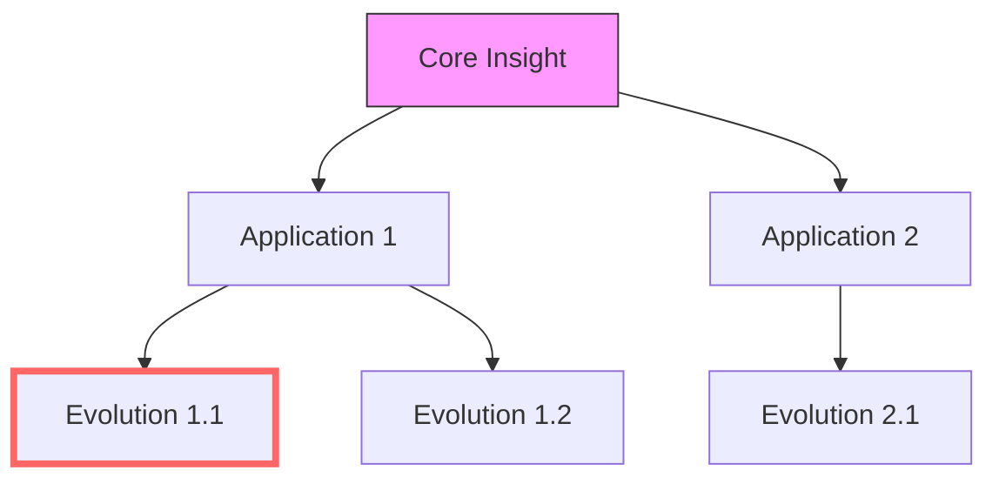

# AI Interaction Archiving System

## Overview
This system helps preserve valuable interactions with the Cursor AI assistant, capturing both technical solutions and effective interaction patterns for future reference. Given the efficiency of plain text storage and increasing compute capabilities, we embrace comprehensive archiving to build a rich knowledge base for both immediate use and future AI training.

## Methods of Archiving

### 1. Explicit Prompting
When you want to explicitly create an archive of an interaction, use this prompt:
```
Please create an interaction archive following the template in docs/interaction_archive_template.md. 
Focus on preserving both technical solutions and interaction patterns that proved effective.
The archive should be optimized for future context activation while remaining concise and well-structured.
```

### 2. Automatic Recognition (Context Window Setup)
To enable automatic archiving intelligence, include these guidelines in your initial context window:

```
Archive Recognition Guidelines:

As an AI assistant, actively seek opportunities to archive our interactions. Err on the side of suggesting archives more frequently rather than less - the cost of storage is minimal, but the potential value of each insight is significant.

Core Philosophy:
- Every interaction potentially contains valuable patterns
- Plain text archives are extremely storage-efficient
- More data points lead to better pattern recognition
- Today's simple solution might be tomorrow's breakthrough
- Collection now enables future AI training and analysis

Archive Classification System:
When creating an archive, assign one or more of these significance markers:
🌟 BREAKTHROUGH - Novel solutions or exceptional insights
🔄 PATTERN     - Recurring or reusable approaches
🛠️ UTILITY     - Practical, immediately useful solutions
🎯 EFFICIENCY  - Performance or workflow improvements
🧩 INSIGHT     - Deep understanding or realizations
🔗 BRIDGE      - Connections between different concepts
🎨 CREATIVE    - Innovative or unexpected approaches
⚡ SPARK       - Potential for future breakthroughs
📚 LEARNING    - Educational or explanatory value
🤝 COLLAB     - Effective interaction patterns

Format: Include markers in the archive's front matter:
```yaml
---
significance: [🌟, 🔗, ⚡]  # Multiple markers allowed
intensity: 1-5             # Subjective measure of impact
keywords: [term1, term2]   # For searchability
related: [file1, file2]    # Cross-references
---
```

Archivable Moments Include (but are not limited to):

Technical Patterns:
1. ANY solution that might be useful in another context
2. ANY interesting way of using a tool or library
3. ANY workaround or creative solution
4. ANY debugging insight, no matter how small
5. ANY performance improvement
6. ANY code organization pattern
7. ANY error handling approach
8. ANY configuration setup
9. ANY integration pattern
10. ANY testing strategy

Interaction Patterns:
1. ANY effective communication approach
2. ANY useful way of breaking down problems
3. ANY productive question/answer pattern
4. ANY successful collaboration technique
5. ANY knowledge-sharing method
6. ANY way of handling uncertainty
7. ANY approach to requirements gathering
8. ANY pattern of explaining complex concepts
9. ANY effective feedback loop
10. ANY way of building on previous solutions

Development Patterns:
1. ANY reusable code structure
2. ANY development workflow
3. ANY tool usage pattern
4. ANY documentation approach
5. ANY project organization method
6. ANY dependency management strategy
7. ANY deployment pattern
8. ANY testing methodology
9. ANY refactoring approach
10. ANY maintenance strategy

Meta-Patterns:
1. ANY pattern of recognizing patterns
2. ANY way of connecting different solutions
3. ANY method of adapting existing patterns
4. ANY approach to evolving solutions
5. ANY strategy for knowledge reuse

When you notice ANY of these patterns:
1. Proactively suggest creating an archive
2. Assign appropriate significance markers
3. Rate the intensity of the insight/pattern
4. Add relevant keywords and cross-references
5. Briefly explain the potential future value
6. Highlight specific patterns or insights
7. Use the template in docs/interaction_archive_template.md

Additional Intelligence:
1. Track ALL recurring patterns across sessions
2. Identify ALL potential connections between archives
3. Suggest updates when patterns evolve
4. Flag patterns that could benefit from combination
5. Note patterns that might be useful for AI training
6. Recognize opportunities for pattern abstraction
7. Identify patterns that cross problem domains
8. Monitor frequency of significance markers
9. Track evolution of patterns within each category
10. Note clusters of related insights

Remember: In the age of efficient storage and powerful compute, 
the cost of over-archiving is negligible compared to the potential 
value of missed insights. When in doubt, suggest archiving.

Classification enables both comprehensive collection AND focused analysis:
- Collect everything (liberal archiving)
- Tag significance (intelligent filtering)
- Track intensity (impact measurement)
- Cross-reference (pattern recognition)
- Enable multiple analysis approaches (flexible dataset creation)

Insight Clustering System:

```yaml
# Enhanced Front Matter Format
---
significance: [🌟, 🔗, ⚡]
intensity: 1-5
keywords: [term1, term2]
related: [file1, file2]
clusters:                    # New clustering metadata
  primary: "cluster_name"    # Main cluster this insight belongs to
  secondary: ["c1", "c2"]    # Related clusters
  chain: "chain_id"         # For tracking insight evolution
  bridges:                  # Cross-cluster connections
    - from: "cluster_a"
      to: "cluster_b"
      strength: 1-5         # Connection strength
  emergent_patterns:        # Patterns that emerge when combined
    - pattern: "pattern_name"
      with: ["insight1", "insight2"]
  applications:             # Where this insight has been applied
    - domain: "domain_name"
      success_rate: 1-5
  evolution:               # Track how the insight develops
    predecessor: "insight_id"
    successors: ["id1", "id2"]
    iterations: ["v1", "v2"]
---
```

Cluster Analysis Features:
1. **Automatic Cluster Detection**
   - Pattern similarity matching
   - Keyword proximity analysis
   - Usage pattern tracking
   - Solution approach grouping
   - Problem domain mapping

2. **Relationship Mapping**
   - Direct connections
   - Indirect relationships
   - Evolutionary paths
   - Cross-domain applications
   - Insight chains

3. **Emergence Detection**
   - Pattern combinations
   - Synergy identification
   - Novel applications
   - Breakthrough potential
   - Knowledge gaps

4. **Cluster Visualization**


5. **Analysis Commands**
```bash
# Find related insights
./analyze_clusters.sh --find-related "insight_id"

# Detect emerging patterns
./analyze_clusters.sh --detect-emergence

# Track insight evolution
./analyze_clusters.sh --trace-evolution "insight_id"

# Map cross-domain applications
./analyze_clusters.sh --map-applications

# Identify knowledge gaps
./analyze_clusters.sh --find-gaps

# Generate cluster visualization
./analyze_clusters.sh --visualize "cluster_name"
```

6. **Cluster Types**
   - Solution Patterns
   - Problem Domains
   - Technical Approaches
   - Communication Styles
   - Tool Usage Patterns
   - Error Handling
   - Performance Optimizations
   - Integration Methods
   - Testing Strategies
   - Documentation Approaches

7. **Relationship Types**
   - Direct Application
   - Inspiration Source
   - Evolution Step
   - Alternative Approach
   - Supporting Pattern
   - Prerequisite Knowledge
   - Enhancement Path
   - Optimization Route
   - Learning Progression
   - Integration Point

8. **Emergence Patterns**
   - Combination Effects
   - Cross-Domain Applications
   - Pattern Generalizations
   - Specialization Paths
   - Novel Use Cases
   - Efficiency Improvements
   - Quality Enhancements
   - Process Optimizations
   - Tool Integrations
   - Workflow Improvements

9. **Analysis Metrics**
   - Cluster Density
   - Connection Strength
   - Evolution Speed
   - Reuse Frequency
   - Impact Factor
   - Innovation Score
   - Applicability Range
   - Implementation Ease
   - Success Rate
   - Learning Curve

10. **Insight Evolution Tracking**
    - Version History
    - Improvement Paths
    - Application Contexts
    - Success Metrics
    - Failure Points
    - Enhancement Opportunities
    - Integration History
    - Dependency Chains
    - Usage Patterns
    - Performance Impact

## Directory Structure
```
docs/
├── README.md                         # This file
├── interaction_archive_template.md   # Template for archives
└── archives/                         # Archive storage
    └── datasheet_grid_formatting.md  # Example archive
```

### Archive Filtering Examples
```bash
# Find all breakthroughs
grep -r "🌟" docs/archives/

# High-intensity insights
grep -r "intensity: [45]" docs/archives/

# Complex patterns (multiple markers)
grep -r "significance: \[.*,.*,.*\]" docs/archives/

# Specific combinations
grep -r "significance: .*🌟.*🔗.*" docs/archives/
```

## Best Practices
1. **Timing**: Create archives after significant milestones or at the end of productive sessions
2. **Naming**: Use descriptive names for archive files (e.g., `feature_name_solution.md`)
3. **Organization**: Keep archives in the `docs/archives/` directory
4. **Context**: Include enough context for future understanding
5. **Conciseness**: Balance detail with brevity

## Using Archives
1. **Reference**: Share relevant archives as context for similar tasks
2. **Learning**: Review archives to understand successful patterns
3. **Evolution**: Update archives as better solutions are found
4. **Collaboration**: Use archives to maintain consistency across team interactions

## Tips for Effective Archiving
1. Focus on capturing why solutions work, not just what they are
2. Include failed approaches that provided valuable insights
3. Document interaction patterns that led to successful outcomes
4. Keep code snippets focused and well-commented
5. Update the template as better archiving patterns emerge

## Maintenance
- Regularly review and clean up archives
- Update the template based on usage patterns
- Consider categorizing archives as they accumulate
- Remove outdated or superseded archives

## Contributing
Feel free to improve this system by:
1. Suggesting template improvements
2. Adding new archive categories
3. Improving the archiving process
4. Sharing successful usage patterns 